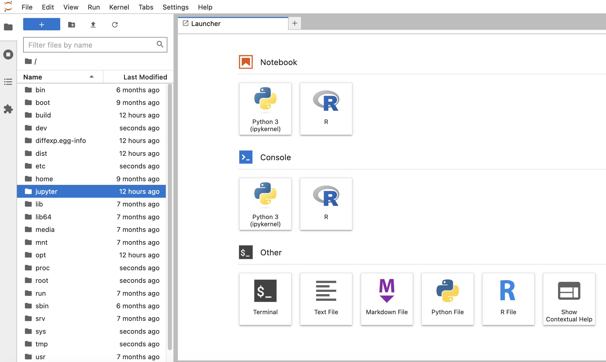

# diffexpr # 
[](https://github.com/wckdouglas/diffexpr/actions) [](https://codecov.io/gh/wckdouglas/diffexpr)

A python package using `rpy2` to port [DESeq2](https://bioconductor.org/packages/release/bioc/html/DESeq2.html) into python.

## Installation ##
Dependencies are `pandas` (python), `rpy2` (python), and `DESeq2` (R)
Best way to setup the environment should be via [docler](#docker), 
but it should also be possible to install the dependency packages using
[conda](https://docs.conda.io/en/latest/): 

```
conda config --add channels defaults
conda config --add channels bioconda
conda config --add channels conda-forge
conda create -q -n diffexpr python=3.6 \
    pandas tzlocal rpy2 biopython ReportLab pytest-cov \
    bioconductor-deseq2 codecov
conda activate diffexpr # activate diffexpr environment
Rscript setup.R #to install DESeq2 correctly 
python setup.py install
```

## <a name="docker"></a> Docker ##

We build two docker images in our [CI workflow](https://github.com/wckdouglas/diffexpr/blob/98166d9ee7c078520dfb55535634a5cdeaf477cf/.github/workflows/CI.yml#L106-L128):
1. diffexpr (`ghcr.io/wckdouglas/diffexpr/diffexpr`): contains minimal dependencies for executing code in this package
2. *diffexpr-dev* (`ghcr.io/wckdouglas/diffexpr/diffexpr-dev`): is the same as `diffexpr`, but with additional python packages (`matplotlib`, `seaborn`, and `jupyterlab`) for using this package in jupyter notebook analysis (see [below](#example) for how to spin up the jupyterlab instance from within the container), feel free to file an issue or put a PR to include your favorite packages!

## <a name="example"></a> Example ##
An example of running DESeq2 in *python* using `diffexpr` package is provided [here](https://github.com/wckdouglas/diffexp/blob/master/example/deseq_example.ipynb).

This should be reproducible by:

```bash
git clone https://github.com/wckdouglas/diffexpr.git
cd diffexpr
docker run \
    -p 1234:1234 \
    --mount type=bind,source="$(pwd)",target=/jupyter \
    ghcr.io/wckdouglas/diffexpr/diffexpr-dev:master
```

and go to http://localhost:1234 to access the jupyter lab instance

The `--mount type=bind,source="$(pwd)",target=/jupyter` option will mount the local filesystem (current directory) at `/jupyter`, such that the container has access to all the files under the current directory, the example notebook is under `/jupyter/example/deseq_example.ipynb`:




## Citation ##
:bangbang: Please cite the original [DESeq2 paper](https://genomebiology.biomedcentral.com/articles/10.1186/s13059-014-0550-8) if you used this package in your work:

```
@article{Love2014,
  doi = {10.1186/s13059-014-0550-8},
  url = {https://doi.org/10.1186/s13059-014-0550-8},
  year = {2014},
  month = dec,
  publisher = {Springer Science and Business Media {LLC}},
  volume = {15},
  number = {12},
  author = {Michael I Love and Wolfgang Huber and Simon Anders},
  title = {Moderated estimation of fold change and dispersion for {RNA}-seq data with {DESeq}2},
  journal = {Genome Biology}
}
```

## Alternatives ##

[pyDESeq2](https://github.com/owkin/PyDESeq2) is a pure python implementation of DESeq2. 
